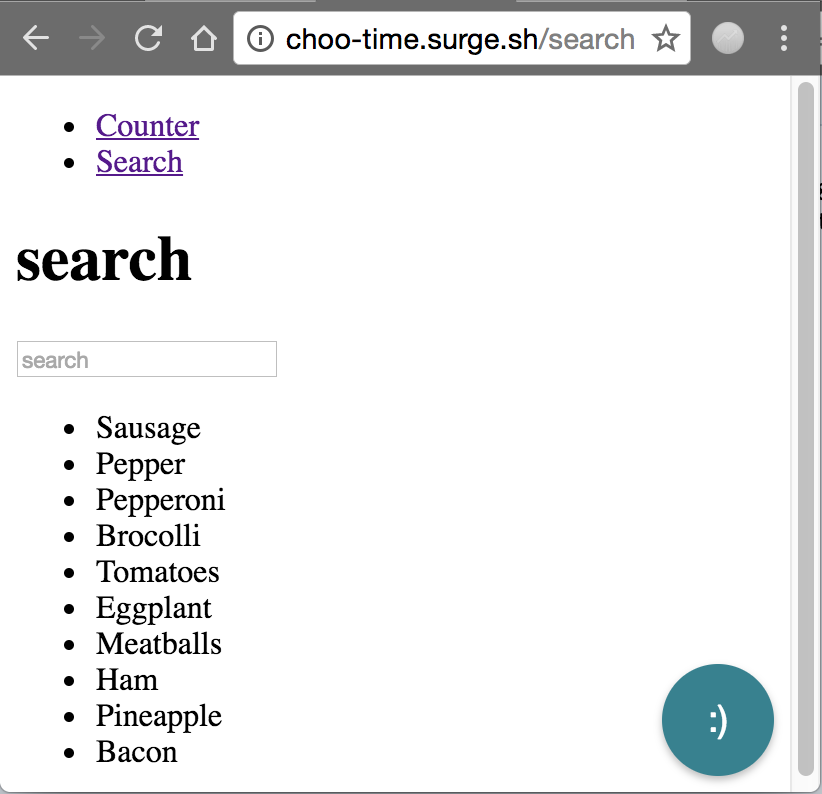

# choo-time 


## Quickstart

It is quick and easy to start hacking time. Add it to your project using npm, implement it as a choo middleware, and then add a line of code to your reducers hash.

installation from npm:

 `npm install choo-time --save-dev`

add as a middleware:

```
const chooTime = require('choo-time')

app.use(chooTime())
```

add the "refresh" reducer

``` 
var myModel = {
    reducers: {
        refresh: (data, state) => state,
        ...
    }
}
```

start your app and then you should see a red smiley face button
in the button right of your app. 



Start click through your app and watch the tool button enumerate. 
This is a count of your actions. 

Click on the button and check out the complete timeline of actions for your app

)
